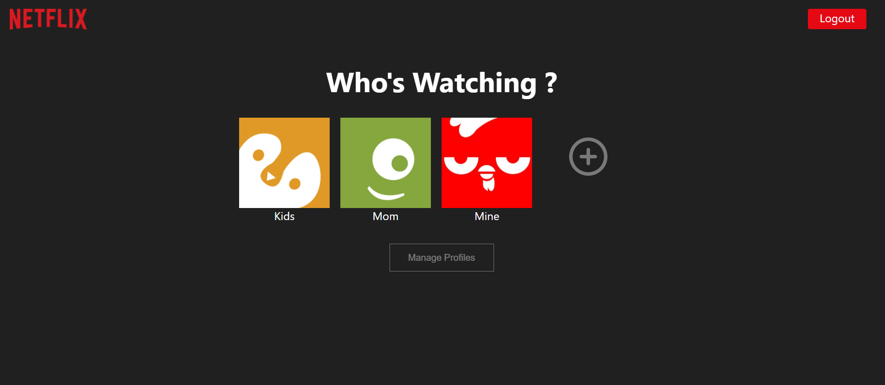
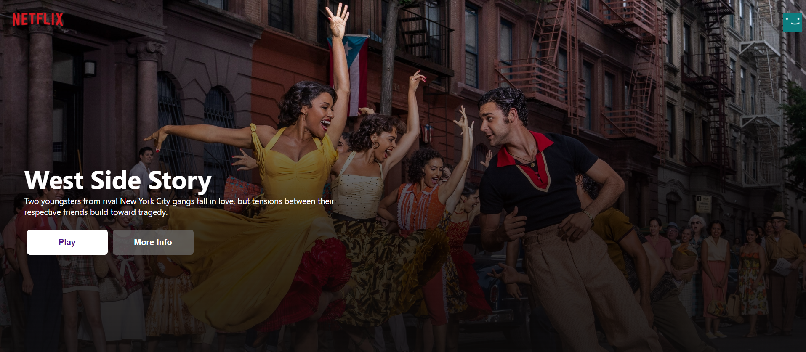
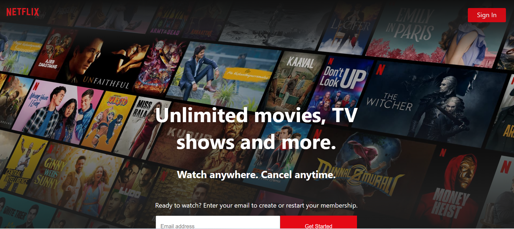
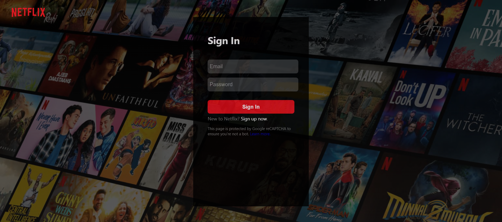
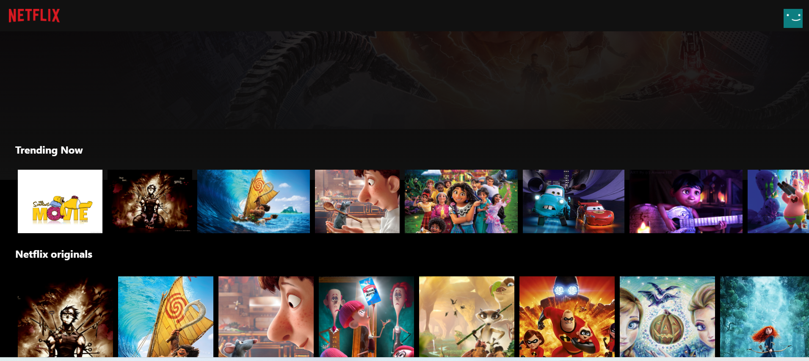
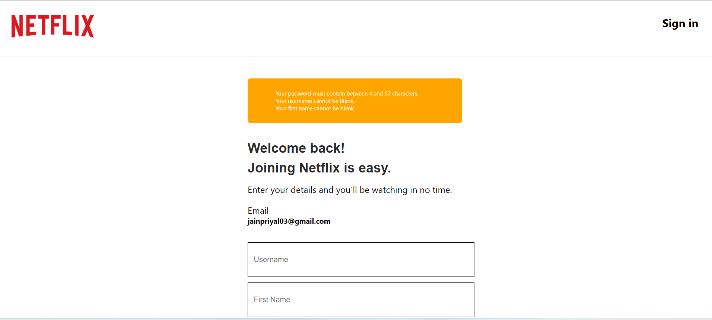
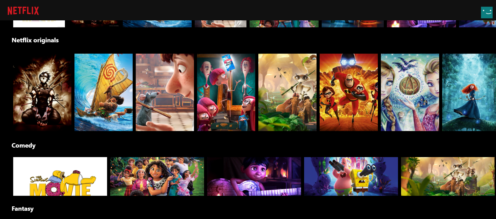

Project Description :
A simplified Netflix clone application . This Project is created with an intention to Learn ReactJS and Django integration .
Inside the Application Creaged Login , Signup , Movie Browsing Page , Movie Detail Page , Profile list page , create and edit of profile . 

Find Below the snapshots of the deployed application .

Checkout my Application Here : https://netflixclone-application.herokuapp.com/